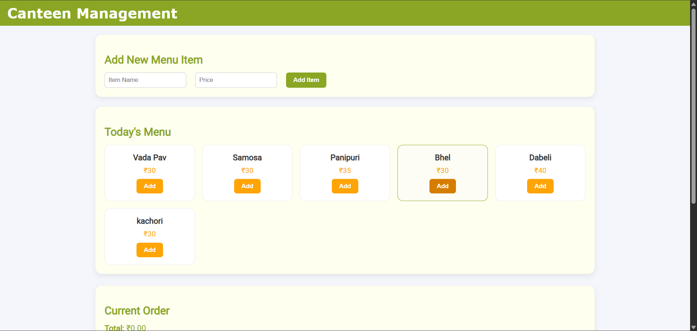
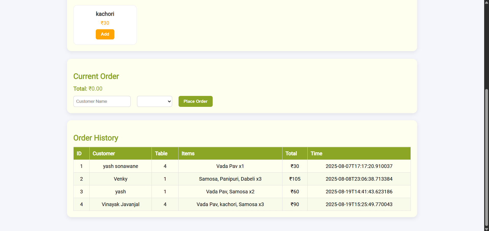

---

# CANTEEN MANAGEMENT SYSTEM

A simple canteen management app with a Spring Boot backend and an Angular 17 frontend.

* **Backend** exposes REST APIs for menu, orders, and order history
* **Frontend** provides a UI to add/view menu items, place orders, and view order history

---

## FEATURES

* **MANAGE MENU:** Add, update, delete, and list canteen menu items with price and category.
* **PLACE ORDERS:** Create orders with customer name and table number; supports multiple items per order.
* **ORDER HISTORY:** View all past orders with itemized details and totals.
* **REAL-TIME MENU:** Frontend fetches current menu and availability via API.
* **PERSISTENT DATA:** All data stored in PostgreSQL for reliability.
* **RESPONSIVE WEB UI:** Clean Angular interface for quick operations.

---

## TECHNOLOGIES USED

* **Backend:** Java 17+, Spring Boot 3.2+, Spring Data JPA (Hibernate)
* **Database:** PostgreSQL (prod) and H2 (optional, for quick dev)
* **Frontend:** Angular 17, Angular CLI, TypeScript
* **Build Tool:** Maven

---

## DEPENDENCIES

This project uses the following Maven dependencies (see `pom.xml`):

```xml
<dependency>
    <groupId>org.springframework.boot</groupId>
    <artifactId>spring-boot-starter-web</artifactId>
</dependency>
<dependency>
    <groupId>org.springframework.boot</groupId>
    <artifactId>spring-boot-starter-data-jpa</artifactId>
</dependency>
<dependency>
    <groupId>org.postgresql</groupId>
    <artifactId>postgresql</artifactId>
    <scope>runtime</scope>
</dependency>
<dependency>
    <groupId>org.springframework.boot</groupId>
    <artifactId>spring-boot-starter-thymeleaf</artifactId>
</dependency>
```

---

## Backend configuration

`src/main/resources/application.properties` is set for PostgreSQL:

```properties
spring.datasource.url=jdbc:postgresql://localhost:5432/canteen
spring.datasource.username=postgres
spring.datasource.password=12345
spring.jpa.hibernate.ddl-auto=update
spring.jpa.show-sql=true
spring.jpa.properties.hibernate.dialect=org.hibernate.dialect.PostgreSQLDialect

# Server
server.port=8080
spring.application.name=Canteen
```

---

## PREREQUISITES

* Java 17+
* Maven
* Node.js 20 LTS + npm
* PostgreSQL (if not using H2)

---

## DATABASE SETUP

Create a PostgreSQL database named `canteen`:

```sql
CREATE DATABASE canteen;
```

Update DB credentials in `application.properties` (see above).

---

## Project structure (key parts)

```text
Canteen/
├── .mvn/
├── frontend/
│   ├── angular.json
│   ├── package-lock.json
│   ├── package.json
│   ├── proxy.conf.json
│   └── src/
│       ├── main.ts
│       ├── styles.css
│       └── app/
│           ├── app.component.ts
│           ├── app.routes.ts
│           ├── models/
│           │   ├── menu-item.model.ts
│           │   └── order.model.ts
│           ├── services/
│           │   └── canteen.service.ts
│           └── pages/
│               ├── menu-page.component.ts
│               ├── order-page.component.ts
│               └── orders-history-page.component.ts
├── src/
│   ├── main/java/com/example/Canteen/
│   │   ├── CanteenApplication.java
│   │   ├── CanteenController.java
│   │   ├── MenuItem.java
│   │   ├── MenuItemRepository.java
│   │   ├── MenuItemService.java
│   │   ├── OrderItem.java
│   │   ├── Order.java
│   │   ├── OrderRepository.java
│   │   ├── OrderService.java
│   │   └── OrderController.java
│   ├── main/resources/
│   │   └── application.properties
│   └── test/java/com/example/Canteen/
│       └── CanteenApplicationTests.java
├── target/
├── .gitattributes
├── .gitignore
├── HELP.md
├── mvnw
├── mvnw.cmd
├── pom.xml
└── README.md
```

---

## How to run (Windows PowerShell)

### 1) Install Node.js 20 LTS (if not installed)

```powershell
winget install OpenJS.NodeJS.LTS --silent --accept-package-agreements --accept-source-agreements
```

### 2) Allow running npm/npx scripts once per user (fixes execution policy error)

```powershell
Set-ExecutionPolicy -ExecutionPolicy RemoteSigned -Scope CurrentUser
```

### 3) Start the backend (Spring Boot)

```powershell
cd "F:\Canteen"
.\mvnw.cmd spring-boot:run
```

> Alternatively: `mvn spring-boot:run`

### 4) Start the frontend (Angular)

```powershell
cd "F:\Canteen\frontend"
npm install
ng serve --open
```

If using a dev proxy, ensure `frontend/proxy.conf.json` proxies `/api` to `http://localhost:8080`.

---

## API Endpoints

* **Menu**

  * `GET /api/canteen/menu` — List all menu items
  * `POST /api/canteen/menu` — Create a menu item
  * `PUT /api/canteen/menu/{id}` — Update a menu item
  * `DELETE /api/canteen/menu/{id}` — Delete a menu item
* **Orders**

  * `POST /api/canteen/order` — Place an order (JSON includes customerName, tableNumber, items\[])
  * `GET /api/canteen/orders` — Get all orders (history)
  * `DELETE /api/canteen/orders/{id}` — Delete/cancel an order by ID

---

## CONTACT

**Developer:** Vinayak Sonawane

**Email:** vinayaksonwane377@gmail.com

**GitHub:** Vinayak07032007

---

## SCREENSHOT



